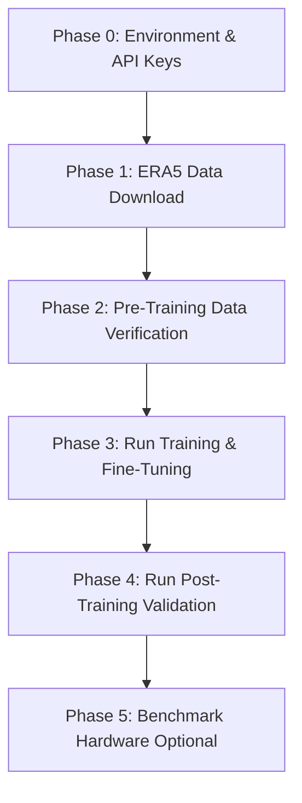

# GraphCast CHAMP Server Deployment & Execution Guide

This guide provides a step-by-step sequence to configure, download, validate, train, and test the GraphCast model on your server.

> **Working Directory**: All commands must be run from the **`graphcast/`** root folder (where `graphcast/`, `production_pipeline/`, and `checkpoints/` directories exist).

---

## Overview of the Execution Sequence
Follow these phases in order:



---

## 🚀 Quick Start Command Flow
For a standard run, execute these commands sequentially from the root of your workspace:

```bash
# Step 1: Set up the environment & install graphcast package
conda env create -f environment.yml
conda activate graphcast
pip install -e "c:\Users\Asus\Clone files\graphcast"

# Step 2: Test Copernicus CDS API connection (Global grid verification)
python data_collection/era5_downloader.py --test --region global

# Step 3: Run pre-training validation (pipeline check + NaN audit)
python test_data_pipeline.py
python validate_training_inputs.py

# Step 4: Run GNN training (20 epochs)
python run_unseen_workflow.py --stage 3 --year 2016 --use-simulation --epochs 20

# Step 5: Evaluate model generalization & generate validation scorecard
python run_unseen_workflow.py --stage 2 --year 2016 --checkpoint checkpoints/model_2016.nc --eval-days 15

# Step 6: Run compute & memory benchmarking report
python benchmark_hardware.py

# Step 7: Run operational API & dashboard
python -m uvicorn production_pipeline.app:app --port 8000
```

---


## Phase 0: Environment & API Configuration

Before running any script, make sure your Python environment, CUDA drivers, and Copernicus Climate Data Store (CDS) credentials are set up.

### 1. Set Up the Conda Environment
Use the provided `environment.yml` to set up dependencies (including JAX, Haiku, Optax, and NetCDF processing libraries):
```bash
conda env create -f environment.yml
conda activate graphcast
```

> **Verified working packages (as of 2026-07-15):**
> - Python 3.13.9 | JAX 0.10.0 | dm-haiku 0.0.16 | optax 0.2.8 | xarray 2025.10.1 | cdsapi 0.7.7

### 2. Configure CDS API Credentials
GraphCast downloads raw weather data from Copernicus. You must create a `.cdsapirc` file in your user home directory:
* **Linux/WSL2 Path:** `~/.cdsapirc`
* **Windows Path:** `%USERPROFILE%\.cdsapirc`

Write the following inside the file (replace with your API Key from [CDS](https://cds.climate.copernicus.eu/)):
```text
url: https://cds.climate.copernicus.eu/api
key: <YOUR-API-KEY-UUID>
```

> **Note (post-2024 CDS API migration):** The new API uses a single UUID key (no `UID:KEY` format). The URL also changed from `/api/v2` to `/api`.

### 3. GPU/JAX Environment Variables (Recommended for Servers)
To prevent JAX from locking up all GPU VRAM when starting:
```bash
# Set JAX to allocate GPU memory dynamically as needed
export XLA_PYTHON_CLIENT_PREALLOCATE=false
```

> **CPU-only mode**: If no GPU is detected, JAX will automatically fall back to CPU. JIT compilation will take ~8 minutes per training run. A CUDA-enabled GPU is strongly recommended for production.

---

## Phase 1: ERA5 Data Download

Raw dataset files are downloaded to `data/ERA5/raw/{year}/`. Three region options are available:

| Flag | Region | Bounding Box | Use Case |
|---|---|---|---|
| `--region nagpur` *(default)* | Nagpur, India | 17°N–25°N, 74°E–85°E | Fast testing (~40 KB/request) |
| `--region india` | Full India | 6°N–38°N, 66°E–100°E | Regional coverage |
| `--region global` | Global | No restriction | Full GraphCast training (~50–100 GB/year) |

### 1. Test CDS API Connection (Fast)
Verify that the credentials and connection are working:
```bash
python data_collection/era5_downloader.py --test --region nagpur
```
*Expected Output:*
```
✅ CDS API test PASSED
   Variables: ['t2m', 'msl']
   Grid: lat=33, lon=45
   File size: 0.04 MB
```

### 2. Estimate Storage Before Downloading
```bash
python data_collection/era5_downloader.py --estimate --start-year 2015 --end-year 2018 --region nagpur
```

### 3. Download ERA5 Data for a Specific Year
Download the training data (e.g., 2015 or 2016):
```bash
# Download the whole year of 2015 for the Nagpur region
python data_collection/era5_downloader.py --year 2015 --region nagpur

# Download a single month for testing
python data_collection/era5_downloader.py --year 2015 --month 6 --region nagpur

# Download multiple years (2015–2018)
python data_collection/era5_downloader.py --start-year 2015 --end-year 2018 --region nagpur
```

---

## Phase 2: Pre-Training Data & Pipeline Verification

Before running multi-hour training, run these lightweight tests to ensure the loaded data, coordinate mappings, and normalization matrices conform exactly to GraphCast GNN expectations.

### 1. Run Data Pipeline End-to-End Test
This script checks the local sample dataset, aligns coordinates, calculates solar forcing, and tests Z-score normalization:
```bash
python test_data_pipeline.py
```
*Expected Output: `🎉 SUCCESS: All verification steps passed successfully! GraphCast pipeline is robust.`*

**What is verified:**
- 18 input variables present with correct shapes `(1, 2, 181, 360)` / `(1, 2, 13, 181, 360)`
- 11 target variables present and correct
- 5 forcing variables (`toa_incident_solar_radiation`, `year/day_progress_sin/cos`)
- Input times: `[-6h, 0h]` ✓
- Z-score normalization round-trip max error ≤ `4.88e-04`
- 0 NaN values across all variables

### 2. Validate Training Inputs
Ensure the dimensions, coordinates, pressure levels, and lack of NaN values in your downloaded dataset align perfectly before JAX compiles the graph:
```bash
python validate_training_inputs.py
```
*Expected Output: `🎉 Validation Successful: All checks passed! Ready for training.`*

**Dimension checks:**
| Dimension | Expected |
|---|---|
| batch | 1 |
| time | 2 |
| level | 13 |
| lat | 181 |
| lon | 360 |

> **Note:** `FutureWarning` messages about `Dataset.dims` from xarray are cosmetic deprecation warnings — not errors. Safe to ignore.

---

## Phase 3: Run the Training & Fine-Tuning Pipeline

Training compiles the GNN, sets up the AdamW optimizer with Cosine Decay, and executes backpropagation.

**Training configuration:**
| Parameter | Value |
|---|---|
| Optimizer | AdamW |
| Learning rate | `5e-5` |
| Weight decay | `1e-5` |
| LR schedule | Cosine Decay with linear warmup (1000 steps) |
| Gradient clip norm | 32.0 |
| **Default epochs** | **20** |

### Option A: Full Training with Real ERA5 Data (2015 → 2016)
If you want to train chronologically across multiple years using your downloaded ERA5 NetCDF datasets:
```bash
python run_unseen_workflow.py --stage 3 --year 2016 --epochs 20
```
* Note: Omitting the `--use-simulation` flag forces the orchestrator to load the real downloaded ERA5 datasets in `data/ERA5/raw/2016/`, compress them via PCA, and feed them into JAX.
* Completed checkpoint weights will be saved in `checkpoints/model_2016.nc`.

### Option B: Simulation Mode Training (No Download Required)
To train using synthetically varied data (2% noise on the base ERA5 sample) — useful when real data is not yet downloaded:
```bash
python run_unseen_workflow.py --stage 3 --year 2016 --use-simulation --epochs 20
```

### Option C: Quick Dry Run (1 Epoch — Verify Setup Only)
To quickly confirm the pipeline compiles and runs without errors:
```bash
python run_unseen_workflow.py --stage 3 --year 2016 --use-simulation --epochs 1
```

> **Time estimates (CPU-only):**
> - Epoch 1: ~8 min (includes JAX JIT compilation)
> - Epochs 2–20: ~7 min each
> - **Total for 20 epochs: ~2.5–3 hours on CPU**
> - **With GPU: ~10–15 minutes total**

---

## Phase 4: Run Post-Training Validation & Testing

Once training finishes, evaluate how well the model generalizes on unseen years (e.g., validating the 2016 model against 2016 datasets).

### 1. Validate Trained Checkpoint Model
Run Stage 2 to measure forecast accuracy metrics (RMSE, MAE, correlation, bias, and CSI) over lead times:
```bash
python run_unseen_workflow.py --stage 2 --year 2016 --checkpoint checkpoints/model_2016.nc --eval-days 15
```
* Tabular metrics are exported to: `logs/validation_metrics_2016.csv`
* Comparative scorecard plots are saved to: `logs/validation_scorecard_2016.png`

**Sample validation scores (1-epoch simulation baseline — expect improvement after 20 epochs):**

| Variable | +6h Corr | +24h Corr |
|---|---|---|
| 2m_temperature | 0.990 | 0.981 |
| mean_sea_level_pressure | 0.975 | 0.842 |
| 10m u-wind | 0.882 | 0.554 |
| 10m v-wind | 0.838 | 0.395 |
| total_precipitation | 0.408 | 0.091 |

### 2. Understand Model Architecture (Stage 1)
```bash
python run_unseen_workflow.py --stage 1 --checkpoint checkpoints/fine_tuned_model.nc
```

---

## Phase 5: Hardware & Compute Benchmarking (Optional)

To check the execution speed, peak CPU RAM, and GPU VRAM usage of your CHAMP server:
```bash
python benchmark_hardware.py
```
* Outputs a markdown diagnostic report at: `logs/benchmark_report.md`

**Benchmark results on this machine (CPU-only, 16 cores, 15.7 GB RAM):**

| Stage | Time | Peak RAM |
|---|---|---|
| Load dataset (125.78 MB) | 0.39s | 482 MB |
| Preprocessing (TISR + forcings) | 1.71s | 1,012 MB |
| JAX JIT compile + Epoch 1 | 483s (~8 min) | 1,752 MB |
| 72h inference rollout (12 steps) | 366s | 2,414 MB |

---

## Troubleshooting

| Issue | Solution |
|---|---|
| `ModuleNotFoundError: No module named 'graphcast'` | Run scripts from the repo root (`graphcast/`), not from `scripts-graphcast/` |
| `CDS API test FAILED` | Check `%USERPROFILE%\.cdsapirc` — new API format: `url: https://cds.climate.copernicus.eu/api` and `key: <UUID>` (no `UID:KEY` prefix) |
| JAX very slow (8 min compile) | No GPU detected — set `export XLA_PYTHON_CLIENT_PREALLOCATE=false` and install CUDA 11.8 + cuDNN 8.6 |
| `FutureWarning: Dataset.dims` | Cosmetic xarray deprecation warning — safe to ignore, does not affect results |
| `UNIMPLEMENTED: LoadPjrtPlugin` (TPU) | Expected on Windows — JAX falls back to CPU automatically |
| Out of Memory during training | Reduce `mesh_size` or `latent_size` in `run_unseen_workflow.py`, or enable `XLA_PYTHON_CLIENT_MEM_FRACTION=0.7` |
