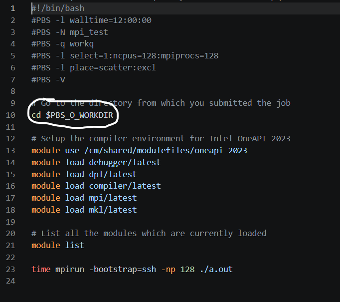
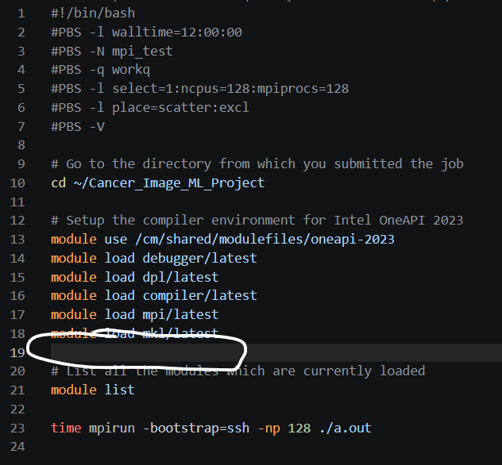
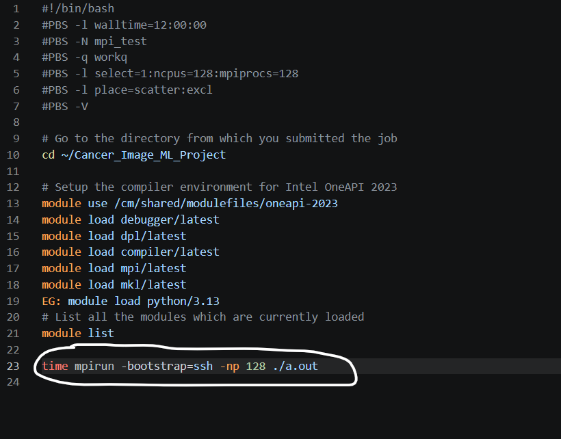
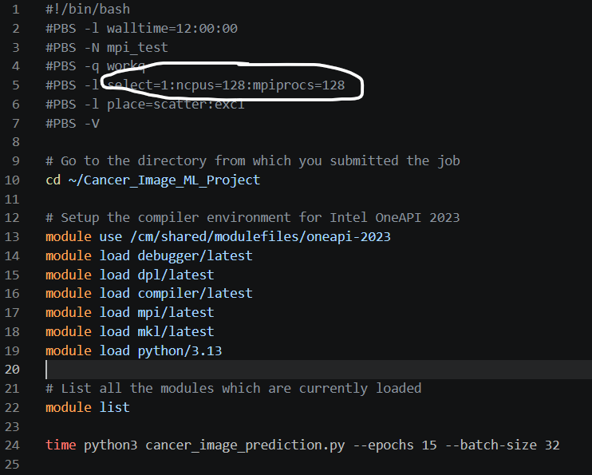
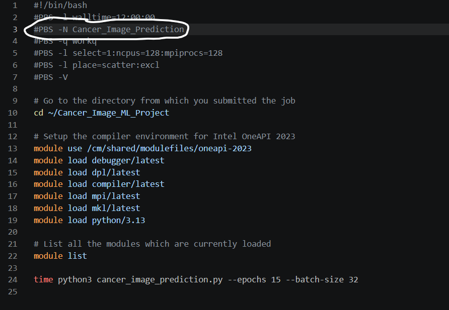
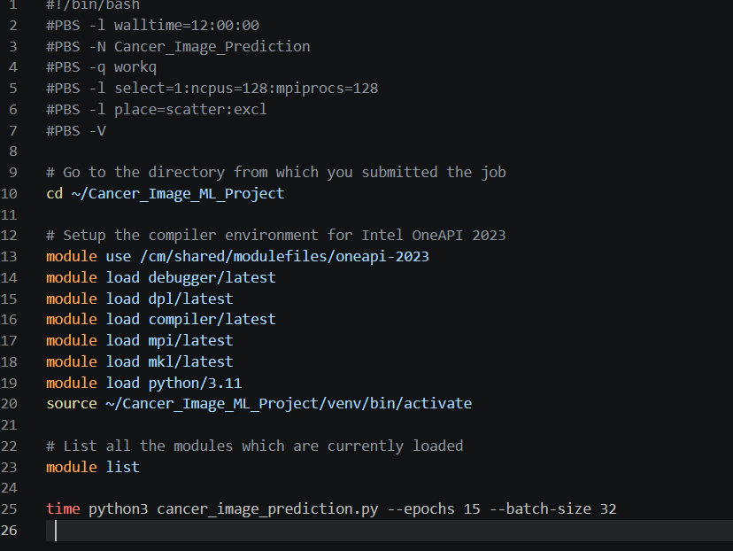

CHAMP LOGIN PROCEDURE

**1. Login to the server**

Login using the credentials provided by the administrator.

**2. Login to the Gateway Server**

Open the terminal and execute:

"*./gateway_login.sh*"

OR

*"ssh <username>@<gateway_ip>"*

Enter the password when prompted.

**3. Login to the CHAMP Server**

From the Gateway Server, execute:

"*ssh -X <username>@champ*"

Enter the password when prompted.

Navigate to the Scratch directory (/scratch/<username>), as it is intended for project repositories, large datasets, and computational workloads. The Home directory (/home/<username>) has limited storage (approximately 100 GB) and is primarily intended for personal files and configuration data.

Command:

Cd /scratch/<username>

**4. Transfer the Project Folder**

The CHAMP login node does not directly access external repositories. Configure the institute proxy because CHAMP cannot access the internet directly.

Run the following commands:

*export http_proxy="http://14.139.134.20:3128"*

*export https_proxy="http://14.139.134.20:3128"*

*export ftp_proxy="ftp://14.139.134.20:3128"*

*export ftps_proxy="ftps://14.139.134.20:3128"*

Load the Git module:

*"module load git/2.33.1"*

Clone the project repository:

*"git clone <GitHub Repository URL>"*

**5. Load the Required Software Modules**

Load all software modules required by the project.

To avoid conflicts use "module purge" before loading any modules

Command: "*module load python/3.11"*

This command loads the software into your current shell session so it can be used.

**6. Navigate to the Project Folder**

Command: *"cd folder_name"*

**7. Verify Project Files**

Ensure that the project contains the required files and folders.

Command: *"ls"*

**8. Setup Environment and Install Required Python Packages *(Only if not already installed)***

SETUP THE ENVIRONMENT
*"python3 -m venv venv"*

*"source venv/bin/activate"*

Inside the folder itself download the packages

EG: *"Pip install -r requirements.txt"*

**9. Navigate to the PBS Script Location**

Command *: "cd ~"* OR *"cd /home/username"*

**10. Edit the PBS script**

10.1) replace the marked with the project location

Command: cd /home/username/folder_name

10.2) load the required modules here and the environment

Command: *"module load python/3.11 "*

AND *"source ~/Cancer_Image_ML_Project/venv/bin/activate"*

10.3) Now replace the last line with the file that you want to run

Command: *"time python3 cancer_image_prediction.py --epochs 15 --batch-size 32"*

10.4) Edit this based on the no. of requirements of nodes, CPUs and MPI Processors

10.5) edit the job name as per requirement

FINAL LOOK (SAMPLE)

**11. Submit the PBS Job**

Submit the batch job.

Command : *"qsub champ_pbs_1node.bash"*

A successful submission returns a Job ID.

EG : 468231.champ1

**12. Monitor the Job**

Check the job status.

Command : *"qstat <jobid>"*

**13. Verify and ZIP outputs**

After the job completes:

Verify that the expected output files have been generated.

Review the PBS output log for any execution errors.

To Zip the outputs use the following command(make sure you are outside the project folder) :

Zip -r <Name_of_zip_file>.zip <location of the part you want to zip>

For example :

zip -r Cancer_Image_ML_Project_output.zip Cancer_Image_ML_Project/outputs/*

**14. Transfer Output Files from CHAMP to Local System**

After the job has completed successfully, transfer the required output files from the CHAMP server to the local computer.

**Step 14.1: Copy the File from CHAMP to the Gateway Server**

From the CHAMP server, execute:

scp /home/<username>/<filename> <username>@<gateway_server>:~

Example:

scp /home/<username>/Cancer_Image_ML_Project_output.zip <username>@<gateway_server>:~

Enter the Gateway Server password when prompted.

**Step 14.2: Copy the File from the Gateway Server to the NEERI Server**

Log in to the NEERI Server and execute:

scp <username>@<gateway_server>:~/Cancer_Image_ML_Project_output.zip <destination_directory>

Example:

scp <username>@<gateway_server>:/home/<username>/Cancer_Image_ML_Project_output.zip /root/champ/

or, if the current working directory is already the desired destination:

scp <username>@<gateway_server>:/home/<username>/Cancer_Image_ML_Project_output.zip .

Enter the Gateway Server password when prompted.

**Step 14.3: Copy the File from the NEERI Server to the Local Computer**

Open a terminal or command prompt on the local computer and execute:

scp <username>@<neeri_server>:<remote_file_path> <local_destination>

Example (Windows PowerShell):

scp <username>@<neeri_server>:/root/champ/Cancer_Image_ML_Project_output.zip "C:\Users\<username>\Downloads\"

Enter the NEERI Server password when prompted.

**Step 14.4: Verify the Download**

Verify that the file has been successfully copied to the specified destination on the local computer.

15) in order to view the NC file then can you can go through the following

https://share.google/aimode/SWpRCRfd3lVggcVEY

https://www.giss.nasa.gov/tools/panoply/

https://mcuntz.github.io/ncvue/html/readme.html
